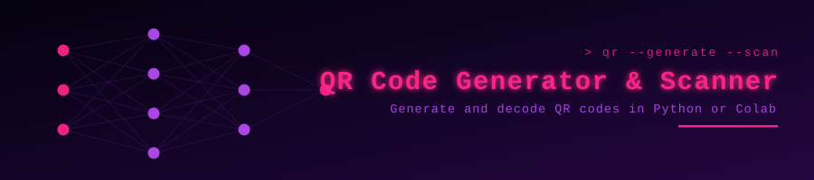

<p align="center">
  
</p>

<p align="center">
  
</p>

<p align="center">
  <a href="https://github.com/muqeetahmaad9/QR-code-app/stargazers"></a>
  <a href="https://github.com/muqeetahmaad9/QR-code-app/commits"></a>
  
</p>

---

### 📖 Overview

Generates QR codes from text, URLs or WiFi credentials, and decodes them from webcam input or uploaded images. Runs locally or in Google Colab.

### ✨ Features

- Generate from text, URLs or WiFi credentials
- Scan and decode via webcam or image upload
- Works locally and in Google Colab

### 🧰 Built With

<p align="left">
  
</p>

### 🚀 Getting Started

```bash
pip install qrcode opencv-python pillow
python qr_generator.py
python qr_scanner.py
```

### 👤 Author

**Muqeet Ahmad** — AI/ML Engineer · IoT & Embedded Systems Builder

<p align="left">
  <a href="https://www.linkedin.com/in/muqeet--ahmad/"></a>
  <a href="https://muqeetahmaad-portfolio.netlify.app/"></a>
  <a href="mailto:muqeetahmad155@gmail.com"></a>
</p>

<p align="center">
  
</p>
